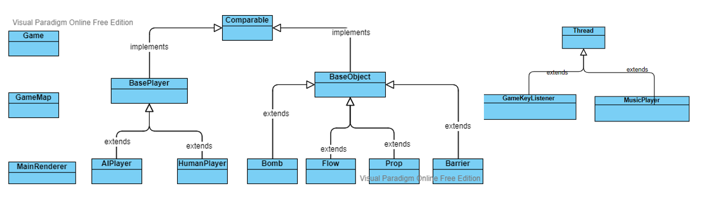

# PKU泡泡堂
## 简介
扮演可爱的人气猫咪, 安放炸弹抵抗入侵PKU的神秘敌人吧! 

## 运行
java -cp bin main.Game

## 游戏操作
上下左右键移动, 空格安放炸弹. 消灭所有敌人获得游戏成功!

**道具模式**: 炸毁障碍物有概率获得不同的道具加成. 

**挑战模式**: 和敌人的接触会受到伤害. 敌人有护盾, 需要多个炸弹连锁爆炸来造成伤害. 

## 文件组织
**bin**: 存放编译后的文件.

**res**: 存放地图, 贴图和简介文本.

**music**: 存放游戏音效.

**src**: 存放源代码文件.

## 源代码组织和类的设计

**Game**: 负责管理事件循环和其他对象. 存放在main文件夹下.

**GameMap**: 负责对地图上所有对象建立基于空间位置的索引. 存放在BaseObject下.

**MainRenderer**: 渲染游戏画面, 管理可视化窗口. 存放在render下.

**BasePlayer**: 表示玩家父类, 子类对应人类和AI玩家. 存放在BasePlayer下.

**BaseObject**: 表示游戏中的各种对象, 如障碍物, 炸弹和道具等. 该类及其子类存放在BaseObject下.

**GameKeyListener和MusicPlayer**: 监听玩家键盘输入和播放音乐的类, 存放在thread下. 这两个任务是时延敏感的, 因此单独占据线程.